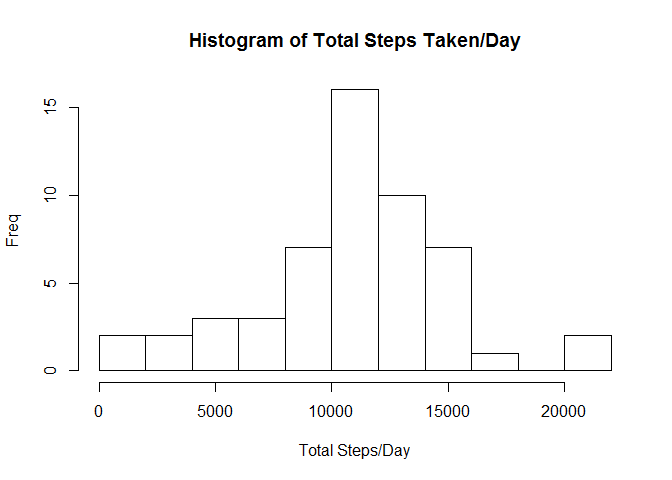
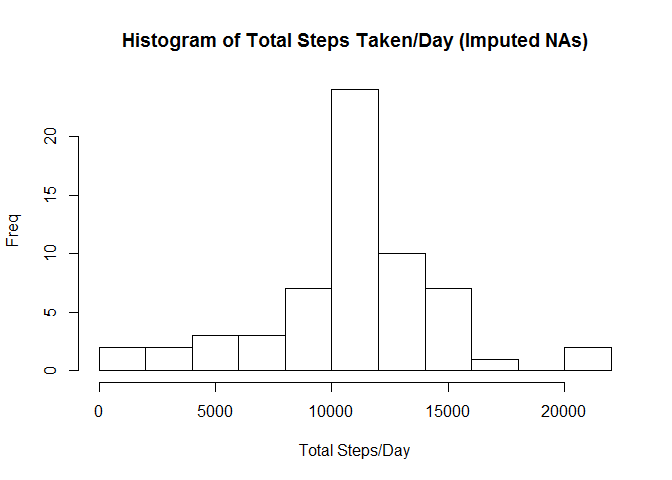
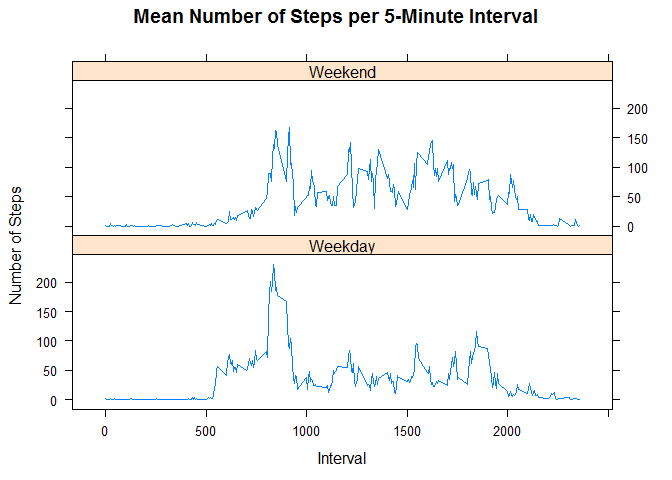

# Reproducible Research: Peer Assessment 1


## Loading and preprocessing the data

```r
library(timeDate)
```

```
## Warning: package 'timeDate' was built under R version 3.1.3
```

```r
library(lattice)
```

```
## Warning: package 'lattice' was built under R version 3.1.3
```

```r
library(knitr)
```

```
## Warning: package 'knitr' was built under R version 3.1.3
```

```r
data <- read.csv("activity.csv")
```

## What is mean total number of steps taken per day?
Make a histogram of the total number of steps taken each day:


```r
data0<-aggregate(data$steps,list(data$date),sum)
good<-!is.na(data0$x)
data0<-data0[good,]

hist(data0$x,breaks=10,main="Histogram of Total Steps Taken/Day",xlab="Total Steps/Day",ylab="Freq")
```

 

Calculate and report the mean and median total number of steps taken per day.

```r
mean(data0$x)
```

```
## [1] 10766.19
```


```r
median(data0$x)
```

```
## [1] 10765
```

## What is the average daily activity pattern?
Make a time series plot of the 5-minute interval (x-axis) and the average number of steps taken, averaged across all days (y-axis)

```r
data0<-aggregate(data$steps,list(data$interval),mean,na.rm=TRUE, na.action=NULL)
plot(data0,type="l",main="Mean Steps Taken per 5-Minute Interval",xlab="5-Minute Interval",ylab="Mean Steps")
```

 

Which 5-minute interval, on average across all the days in the dataset, contains the maximum number of steps?

```r
idx<-data0$x==max(data0$x)
data0$Group.1[idx]
```

```
## [1] 835
```

## Imputing missing values
Calculate and report the total number of missing values in the dataset (i.e. the total number of rows with NAs)

```r
bad<-is.na(data$steps)==TRUE
length(data$steps[bad])
```

```
## [1] 2304
```

Devise a strategy for filling in all of the missing values in the dataset. The strategy does not need to be sophisticated. For example, you could use the mean/median for that day, or the mean for that 5-minute interval, etc. Here I chose to use the mean for that 5-minute interval.

Create a new dataset that is equal to the original dataset but with the missing data filled in

```r
data0<-aggregate(data$steps,list(data$interval),mean,na.rm=TRUE, na.action=NULL)
data0$x<-round(data0$x)
datafill<-data
for (i in 1:dim(datafill)[1]) {
        if (is.na(datafill$steps[i])) {
                idx<-data0$Group.1==datafill$interval[i]
                datafill$steps[i]<-data0$x[idx]
        }
}
data0<-aggregate(datafill$steps,list(datafill$date),sum)
```

Make a histogram of the total number of steps taken each day and Calculate and report the mean and median total number of steps taken per day.

```r
hist(data0$x,breaks=10,main="Histogram of Total Steps Taken/Day (Imputed NAs)",xlab="Total Steps/Day",ylab="Freq")
```

 


```r
mean(data0$x)
```

```
## [1] 10765.64
```


```r
median(data0$x)
```

```
## [1] 10762
```

Do these values differ from the estimates from the first part of the assignment? 

Mean difference:

```r
10765.64-10766.19
```

```
## [1] -0.55
```
Mean difference (%):

```r
100*(10765.64-10766.19)/10765.64
```

```
## [1] -0.005108846
```

Median difference:

```r
10762-10765
```

```
## [1] -3
```
Median difference(%):

```r
100*(10762-10765)/10762
```

```
## [1] -0.02787586
```

What is the impact of imputing missing data on the estimates of the total daily number of steps?

The imputation method of using the mean for each 5-minute interval appears to have a deminimus impact on the final analysis.  Other methods may have more of an impact.

## Are there differences in activity patterns between weekdays and weekends?
Create a new factor variable in the dataset with two levels -- "weekday" and "weekend" indicating whether a given date is a weekday or weekend day.

```r
datafill$weekend<-isWeekend(datafill$date)
idx<-datafill$weekend==TRUE
datafill_we<-datafill[idx,]
datafill_we_mean<-aggregate(datafill_we$steps,list(datafill_we$interval),mean,na.rm=TRUE, na.action=NULL)
datafill_we_mean$type<-rep("Weekend",dim(datafill_we_mean)[1])

idx<-datafill$weekend==FALSE
datafill_wd<-datafill[idx,]
datafill_wd_mean<-aggregate(datafill_wd$steps,list(datafill_wd$interval),mean,na.rm=TRUE, na.action=NULL)
datafill_wd_mean$type<-rep("Weekday",dim(datafill_wd_mean)[1])

final<-rbind(datafill_we_mean,datafill_wd_mean)
```

Make a panel plot containing a time series plot of the 5-minute interval (x-axis) and the average number of steps taken, averaged across all weekday days or weekend days (y-axis). 

```r
xyplot(x~Group.1|type,data=final,layout=c(1,2),xlab="Interval",ylab="Number of Steps",main="Mean Number of Steps per 5-Minute Interval",type="l")
```

 
